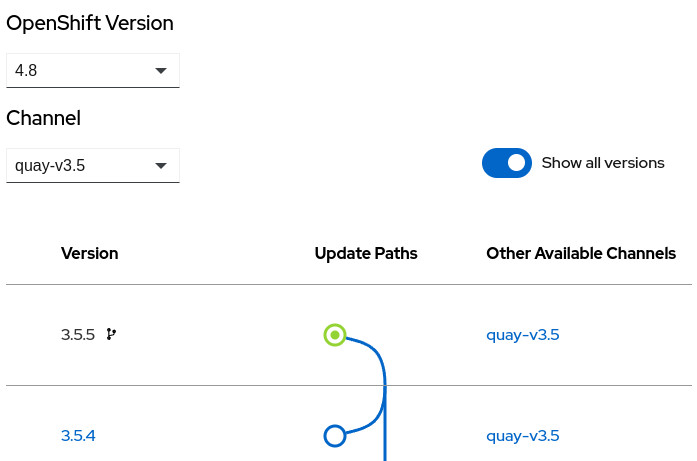

# CPX-OPERATOR-GRAPH

## PURPOSE

The `cpx-operator-graph` displays a graphical representation of
OpenShift operator versions. It uses semver to look for skips,
skip ranges, and replacements. 

## Installation

* `npm install @chapeaux/cpx-operator-graph` or consume from a CDN via `@chapeaux/cpx-operator-graph`
* include the `cpx-operator-graph.js` file on the page
* `import { CPXOperatorGraph } from './cpx-operator-graph'`

## Usage
* `<cpx-operator-graph url="address/of/data"></cpx-operator-graph>`
* `const opgraph = new CPXOperatorGraph()"; opgraph.url = 'https://...';`
* `const opgraph = new CPXOperatorGraph()"; opgraph.data = {...};`

## Testing

* `deno test` runner and assertions: https://deno.land/manual/testing/assertions

## Contributing
1. Provide feedback on usage
2. Submit an issue or PR
3. Feature requests flow through [CPCORE Jira Project](https://issues.redhat.com/projects/CPCORE/)
    * Use "chapeaux" component
    * Priority will be reviewed against all other requests
    * No timeframe promised upon submission

## To-Do
* Nothing at this time